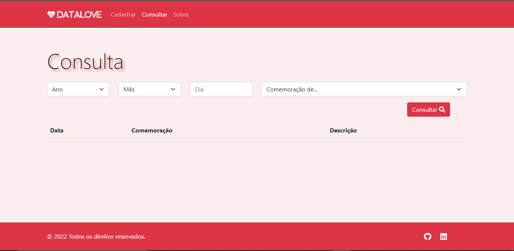

# ➡️[DATALOVE](https://markyscorrea.github.io/app-data-love/)

## 🔖Sobre

O DATALOVE é uma aplicação que consiste em cadastro e pesquisa de datas.

---
#### Cadastro

---
#### Pesquisa

---

## 💻 Teconologias Utilizadas

- HTML
- CSS
- Bootstrap
- JavaScript
- ES6

---

## 🔎 Observações

Aplicação responsiva com armazenamento de dados em LocalStorage.

---

Desenvolvido por Márkys Corrêa.